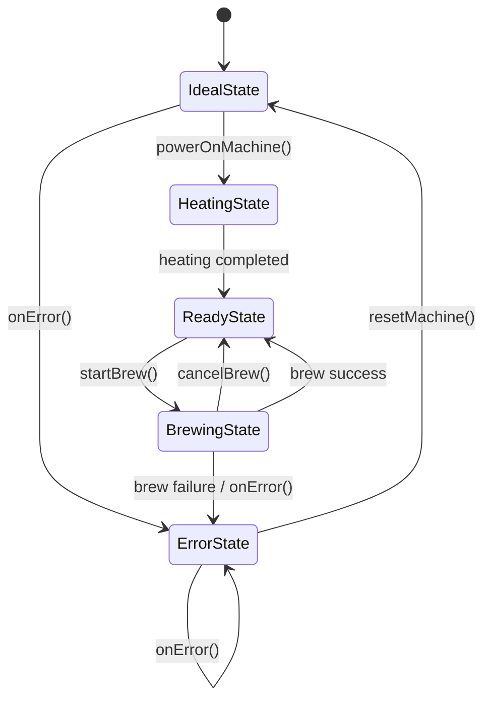
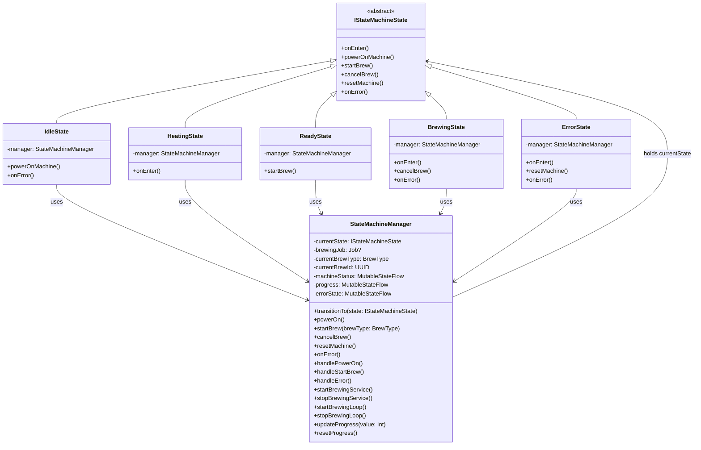

<p align="center">

</p>

# 🔊 Turn Sound On

Enable machine sound effects and brewing audio feedback.

https://github.com/user-attachments/assets/29ce6449-4284-4ccd-b6f1-be94cebb94c9

#  Application States

| Idle State | Heating State |
|---|---|
|  |  |

| Ready State | Brewing State |
|---|---|
|  |  |

| Error State |
|---|
|  |

# 🚀 Running the Mock API Locally

Hey! To run the mock API locally, follow these steps:

---

## 1. Install Mockoon

Download and install Mockoon:

https://mockoon.com/download/

---

## 2. Import the Mock Environment

Open Mockoon, then go to:

```text
File → Open environment
```

Select the provided file:

```text
mock-api-config.json
```

[state_machine_log.txt](https://github.com/user-attachments/files/28124961/state_machine_log.txt)
---

## 4. Configure the Application Base URL

Open the Ktor client configuration att HTTPClient File inside the project and update the base URL to point to your machine’s local IP address:

```kotlin
url("http://<YOUR_LOCAL_IP>:3001/machine/")
```

Example:

```kotlin
url("http://000.000.0.0:3001/machine/")
```
---

# 📱 Android Emulator Note

If you are using the Android Emulator, you can use:

```kotlin
url("http://10.0.2.2:3001/machine/")
```

instead of your local IP.

`10.0.2.2` maps the emulator to your computer's localhost.


# Log states File: 

[state_machine_log.txt](https://github.com/user-attachments/files/28124961/state_machine_log.txt)

# Architecture Overview
The project follows **Clean Architecture** principles, divided into both **feature-based** and **layer-based** packages to ensure high maintainability, scalability, and testability.

---

# Package Structure

## 1. android (Platform Layer)

Handles Android-specific components and hardware/service controllers.

### Contains
- `MainActivity`
- `BaseApplication`
- Foreground services
- Controllers
- Android framework integrations
### Services
- `BrewingForegroundService`
    - Manages background brewing tasks
    - Displays persistent notifications during brewing
### Controllers
- `BrewingServiceController`
    - Handles the lifecycle of the brewing foreground service
- `SoundController`
    - Handles machine sound effects and audio feedback
    - Reacts to brewing state changes
### Dependency Injection
Koin is initialized inside `BaseApplication`.

---

## 2. common (Shared Layer)

Contains reusable and cross-cutting logic shared across the entire application.
The package is divided into:

- `common.data`
- `common.domain`
- `common.ui`

---

## 3. data (Infrastructure Layer)

Responsible for data source implementations and repository infrastructure.

### Contains
- Repository implementations
- Local data sources
- Remote data sources
- Entities
- Data mappers

---

## 4. domain (Business Logic Layer)

The pure Kotlin core of the application, completely independent from the Android framework.

### Contains
- Domain models
- Repository interfaces
- UseCases
- State Machine implementation
---

## 5. ui (Presentation Layer)

The presentation layer follows the **MVI (Model-View-Intent)** architecture for predictable and reactive UI state management.

---

### Contains
- Screens
- Reusable Compose components
- ViewModels
- Contracts
- UI state handling

---

## MVI Structure

### Contract
Defines:
- `State`
    - UI state representation

- `Action`
    - User interactions/intents

- `Effect`
    - One-time side effects such as navigation or toasts

---
### ViewModel

The ViewModel:
- Connects UI with the `StateMachineManager`
- Exposes immutable UI state using `StateFlow`
- Reacts to domain updates
- Processes user actions
---
## How the State Pattern Prevents Invalid States

The Smart Coffee Machine uses the **State Pattern** to make sure each action is only available in the correct machine state.

### The implementation is intentionally simple and clean.  
  
`IStateMachineState` acts as the abstract base class that contains all actions the machine can perform, such as powering on, starting a brew, canceling, resetting, and handling errors.  
  
Each concrete state (`IdleState`, `HeatingState`, `ReadyState`, `BrewingState`, and `ErrorState`) only implements the actions that are valid for that specific state.  
Every state also uses `StateMachineManager` to trigger transitions and execute machine operations.  
  
`StateMachineManager` works as the central controller of the state machine.  
It communicates with the domain layer through use cases such as powering on the machine, brewing coffee, saving brews, logging transitions, and handling errors.  
  
The manager updates observable states like:  
  
- Machine status  
- Brewing progress  
- Error state  
  
These states are exposed to the `ViewModel` using `StateFlow`.  
  
Because of this, the `ViewModel` does not contain business logic or state transition logic.  
It simply observes the data it needs and updates the UI accordingly.  
  
This keeps responsibilities separated:  
  
- States handle behavior  
- Manager controls transitions  
- Use cases handle business logic  
- ViewModel handles UI state only

---

## UML State Diagram



  ## State Pattern Class Diagram


# Foreground Service, Brewing Job & UI Synchronization

The synchronization between the **Foreground Service** and the **Jetpack Compose UI** is orchestrated through a centralized `StateMachineManager` using a dedicated asynchronous brewing job.
When the machine transitions into `BrewingState`, the manager launches a coroutine `Job` responsible for controlling the entire brewing lifecycle and execution flow. At the same time, the `BrewingForegroundService` is started to guarantee background persistence and keep the process alive during long-running operations.
Both the UI layer and the Foreground Service remain perfectly synchronized by reactively observing shared `StateFlow` updates emitted by the `StateMachineManager`

# Smart Network Retry Strategy

The application uses a resilient network retry mechanism powered by **Ktor HttpClient** to gracefully handle transient network failures without negatively impacting the user experience.

---

##  Retry Policy

The `HttpClient` is configured to automatically retry failed requests under specific conditions before reporting a final failure.

### Maximum Retry Attempts
- Up to **3 automatic retries** are performed for eligible failures.


---

## Retry Conditions

Retries are triggered for the following scenarios:
### Server Errors
Automatic retries occur for:
- `5xx Internal Server Errors`
Examples:
- `500 Internal Server Error`
- `502 Bad Gateway`
- `503 Service Unavailable`
---

### Connectivity & Timeout Exceptions

Retries are also triggered when any of the following exceptions occur:

- `SocketTimeoutException`
- `ConnectTimeoutException`
- `HttpRequestTimeoutException`

## PreviewAllVariants

A custom Compose preview utility designed to render UI components across multiple configurations simultaneously.

It helps preview:
- Different font scales
- Multiple device types
- Various screen sizes
- Light & Dark themes

Supported device previews include:
- Phone
- Tablet
- Foldable 

